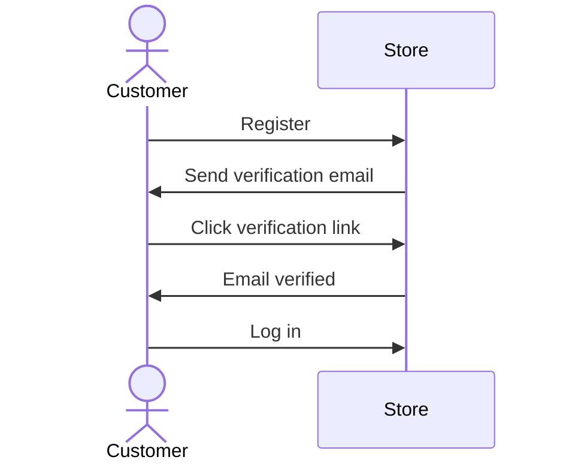

import { Prerequisites, Note } from "docs-ui"

export const metadata = {
  title: `Send Email Verification Notification`,
}

# {metadata.title}

In this guide, you'll learn how to enable email verification requirement for customers in your Medusa application, and how to send email verification notifications.

<Note>

The steps of this guide have changed since Medusa [v2.16.0](https://github.com/medusajs/medusa/releases/tag/v2.16.0). It now uses the `http.authVerificationsPerActor` configuration instead of the `require_verification` option in the Emailpass Auth Module Provider.

</Note>

<Prerequisites
  items={[
    {
      text: "Medusa v2.16.0 or later",
      link: "!docs!/learn/update"
    },
    {
      text: "Notification Module Provider for the email channel, such as SendGrid or Resend",
      link: "/infrastructure-modules/notification#what-is-a-notification-module-provider"
    }
  ]}
/>

## How Email Verification Works

By default, customers can register an account and log in to your Medusa store without verifying their email address. You can enable email verification to require customers to verify their email address before they can log in.

When email verification is enabled, the customer registration flow changes to the following:



1. A customer registers an account by providing their email and password.
2. The customer receives an email with a verification link. The link points to a page in your storefront that verifies the customer's email when visited.
3. The customer clicks the verification link, which verifies their email address and completes the registration process.
4. The customer can now log in to their account.

This guide focuses on the backend implementation of this flow, which involves enabling email verification and sending the verification email.

To implement the storefront part of the flow, refer to the [Verify Customer Account in Storefront guide](../../../storefront-development/customers/verify-account/page.mdx).

---

## Enable Email Verification

To enable email verification, set the `http.authVerificationsPerActor` configuration in `medusa-config.ts`:

export const configHighlights = [
  ["6", "authVerificationsPerActor", "Object specifying the required verification methods per actor type. Include `customer` to require email verification for customers."],
]

```ts title="medusa-config.ts" highlights={configHighlights}
module.exports = defineConfig({
  // ...
  projectConfig: {
    // ...
    http: {
      authVerificationsPerActor: {
        customer: [
          {
            entity_type: "email",
            auth_provider: "emailpass",
          },
        ],
      },
    },
  },
})
```

The `http.authVerificationsPerActor` configuration is an object that specifies the required verification methods for each actor type. The value for each actor type is an array of objects, each specifying a verification method. In this case, you include the `customer` actor type and specify that email verification is required using the `emailpass` auth provider.

<Note>

Learn more in the [authVerificationsPerActor configuration reference](!docs!/learn/configurations/medusa-config#httpauthVerificationsPerActor).

</Note>

---

## Send Email Verification Notification

When the storefront requests to send an email verification notification, Medusa emits the `auth.verification_requested` event. You can listen to this event in a [subscriber](!docs!/learn/fundamentals/events-and-subscribers) to send the email verification notification.

### Prerequisite Configurations

#### Notification Module Provider for Email Channel

To send the email verification notification, you need a [Notification Module Provider](../../../infrastructure-modules/notification/page.mdx#what-is-a-notification-module-provider) configured for the email channel, such as [SendGrid](../../../infrastructure-modules/notification/sendgrid/page.mdx) or [Resend](../../../integrations/guides/resend/page.mdx).

For development purposes, you can set the [Notification Local Module Provider](../../../infrastructure-modules/notification/local/page.mdx)'s channel to `email` in `medusa-config.ts`:

```ts title="medusa-config.ts"
module.exports = defineConfig({
  // ...
  modules: [
    {
      resolve: "@medusajs/medusa/notification",
      options: {
        providers: [
          // ...
          {
            resolve: "@medusajs/medusa/notification-local",
            id: "local",
            options: {
              channels: ["email"],
            },
          },
        ],
      },
    },
  ],
})
```

This will log the email verification notification to the console when it's sent, instead of actually sending an email.

#### Storefront URL Configuration

To format the verification link in the email, you need to set the URL to your storefront in `medusa-config.ts`. You can use the `admin.storefrontUrl` configuration for that:

```ts title="medusa-config.ts"
module.exports = defineConfig({
  // ...
  admin: {
    storefrontUrl: process.env.STOREFRONT_URL || "https://storefront.com",
  },
})
```

This will allow you to use the `admin.storefrontUrl` value in the subscriber when formatting the verification link. If `admin.storefrontUrl` is not set, you can use a placeholder URL as shown in the subscriber example below.

### Email Verification Notification Subscriber

To send the email verification notification when the `auth.verification_requested` event is emitted, create a [subscriber](!docs!/learn/fundamentals/events-and-subscribers) at `src/subscribers/send-email-verification.ts` with the following content:

```ts title="src/subscribers/send-email-verification.ts"
import {
  SubscriberArgs,
  type SubscriberConfig,
} from "@medusajs/medusa"
import { Modules } from "@medusajs/framework/utils"

export default async function verificationRequestedHandler({
  event: { data: {
    entity_id: email,
    entity_type,
    code,
  } },
  container,
}: SubscriberArgs<{
  entity_id: string
  entity_type: string
  code_provider: string
  auth_identity_id: string
  code: string
  expires_at: string
  metadata?: Record<string, unknown>
}>) {
  // only handle email verifications.
  if (entity_type !== "email") {
    return
  }

  const notificationModuleService = container.resolve(
    Modules.NOTIFICATION
  )
  const config = container.resolve("configModule")

  const urlPrefix = config.admin.storefrontUrl || "https://storefront.com"

  console.log(`${urlPrefix}/verify-account?token=${code}&email=${email}`)

  await notificationModuleService.createNotifications({
    to: email,
    channel: "email",
    // TODO replace with template ID in notification provider
    template: "email-verification",
    data: {
      // a URL to a frontend application
      verification_url: `${urlPrefix}/verify-account?token=${code}&email=${email}`,
    },
  })
}

export const config: SubscriberConfig = {
  event: "auth.verification_requested",
}
```

#### Event Payload

This subscriber receives in the event payload an object with the following properties:

- `entity_id`: The identifier of the provider identity to verify. For email verification, this is the customer's email address.
- `entity_type`: The kind of entity being verified, such as `email`. You check that it's `email` before sending the notification, since you only want to handle email verifications.
- `code`: The verification code to include in the verification link. When the customer clicks the verification link, the storefront should send the code back to the Medusa application to verify the customer's email address.
- `code_provider`: The verification provider used to generate the code. By default, this is `token`.
- `auth_identity_id`: The ID of the auth identity for which the verification was requested.
- `expires_at`: The date and time at which the verification code expires.
- `metadata`: Optional metadata included in the verification request.

#### Subscriber Implementation

In the subscriber, you first check that the `entity_type` is `email` to only handle email verifications. Then, you format the storefront URL either using the value of `admin.storefrontUrl` set in `medusa-config.ts` or a placeholder URL. You need this URL to format the verification link sent in the email.

Then, you send a notification using the Notification Module's main service. You pass the following properties to the `createNotifications` method:

- `to`: The email address of the customer to which the verification email should be sent.
- `channel`: The channel to send the notification through. In this case, it's `email`.
- `template`: The ID of the template to use for the notification. This depends on your Notification Module Provider. For example, if you're using the SendGrid Notification Module Provider, this should be the ID of a SendGrid template that you've set up to format the email verification notification.
- `data`: The data to be passed to the template when sending the notification. In this case, you pass the `verification_url` property, which contains the verification link to be included in the email.

The verification link points to a page in your storefront, such as `/verify-account`, which should handle verifying the customer's email when visited.

---

## Handle Email Verification in Storefront

When the customer clicks the verification link, they should be directed to a page in your storefront that sends the token back to the Medusa application to verify the customer's email address.

To learn how to implement this part of the flow, refer to the [Verify Customer Account in Storefront guide](../../../storefront-development/customers/verify-account/page.mdx).

---

## Example Notification Templates

The following section provides example notification templates for some Notification Module Providers.

### SendGrid

<Note>

Refer to the [SendGrid Notification Module Provider](../../../infrastructure-modules/notification/sendgrid/page.mdx) documentation for more details on how to set up SendGrid.

</Note>

The following HTML template can be used with SendGrid to send an email verification email:

```html
<!DOCTYPE html>
<html>
<head>
    <meta charset="utf-8">
    <meta name="viewport" content="width=device-width, initial-scale=1.0">
    <title>Verify Your Email</title>
    <style>
        body {
            font-family: -apple-system, BlinkMacSystemFont, 'Segoe UI', 'Roboto', 'Oxygen', 'Ubuntu', 'Cantarell', 'Fira Sans', 'Droid Sans', 'Helvetica Neue', sans-serif;
            background-color: #ffffff;
            margin: 0;
            padding: 20px;
        }
        .container {
            max-width: 465px;
            margin: 40px auto;
            border: 1px solid #eaeaea;
            border-radius: 5px;
            padding: 20px;
        }
        .header {
            text-align: center;
            margin: 30px 0;
        }
        .title {
            color: #000000;
            font-size: 24px;
            font-weight: normal;
            margin: 0;
        }
        .content {
            margin: 32px 0;
        }
        .text {
            color: #000000;
            font-size: 14px;
            line-height: 24px;
            margin: 0 0 16px 0;
        }
        .button-container {
            text-align: center;
            margin: 32px 0;
        }
        .verify-button {
            background-color: #000000;
            border-radius: 3px;
            color: #ffffff;
            font-size: 12px;
            font-weight: 600;
            text-decoration: none;
            text-align: center;
            padding: 12px 20px;
            display: inline-block;
        }
        .verify-button:hover {
            background-color: #333333;
        }
        .url-section {
            margin: 32px 0;
        }
        .url-link {
            color: #2563eb;
            text-decoration: none;
            font-size: 14px;
            line-height: 24px;
            word-break: break-all;
        }
        .disclaimer {
            margin: 32px 0;
        }
        .disclaimer-text {
            color: #666666;
            font-size: 12px;
            line-height: 24px;
            margin: 0 0 8px 0;
        }
        .security-footer {
            margin-top: 32px;
            padding-top: 20px;
            border-top: 1px solid #eaeaea;
        }
        .security-text {
            color: #666666;
            font-size: 12px;
            line-height: 24px;
            margin: 0;
        }
    </style>
</head>
<body>
    <div class="container">
        <div class="header">
            <h1 class="title">Verify Your Email</h1>
        </div>

        <div class="content">
            <p class="text">
                Hello,
            </p>
            <p class="text">
                Thanks for creating an account. Please confirm your email address by clicking the button below to complete your registration.
            </p>
        </div>

        <div class="button-container">
            <a href="{{verification_url}}" class="verify-button">
                Verify Email
            </a>
        </div>

        <div class="url-section">
            <p class="text">
                Or copy and paste this URL into your browser:
            </p>
            <a href="{{verification_url}}" class="url-link">
                {{verification_url}}
            </a>
        </div>

        <div class="disclaimer">
            <p class="disclaimer-text">
                This verification link will expire soon for security reasons.
            </p>
            <p class="disclaimer-text">
                If you didn't create an account, you can safely ignore this email.
            </p>
        </div>

        <div class="security-footer">
            <p class="security-text">
                For security reasons, never share this verification link with anyone. If you're having trouble with the button above, copy and paste the URL into your web browser.
            </p>
        </div>
    </div>
</body>
</html>
```

Make sure to pass the `verification_url` variable to the template, which contains the URL to verify the customer's email.

You can also customize the template further to show other information.

### Resend

If you've integrated Resend as explained in the [Resend Integration Guide](../../../integrations/guides/resend/page.mdx), you can add a new template for email verification at `src/modules/resend/emails/email-verification.tsx`:

```tsx title="src/modules/resend/emails/email-verification.tsx"
import { 
  Text, 
  Container, 
  Heading, 
  Html, 
  Section, 
  Tailwind, 
  Head, 
  Preview, 
  Body, 
  Link,
  Button, 
} from "@react-email/components"

type EmailVerificationEmailProps = {
  verification_url: string
}

function EmailVerificationEmailComponent({ verification_url }: EmailVerificationEmailProps) {
  return (
    <Html>
      <Head />
      <Preview>Verify your email</Preview>
      <Tailwind>
        <Body className="bg-white my-auto mx-auto font-sans px-2">
          <Container className="border border-solid border-[#eaeaea] rounded my-[40px] mx-auto p-[20px] max-w-[465px]">
            <Section className="mt-[32px]">
              <Heading className="text-black text-[24px] font-normal text-center p-0 my-[30px] mx-0">
                Verify Your Email
              </Heading>
            </Section>

            <Section className="my-[32px]">
              <Text className="text-black text-[14px] leading-[24px]">
                Hello,
              </Text>
              <Text className="text-black text-[14px] leading-[24px]">
                Thanks for creating an account. Please confirm your email address by clicking the button below to complete your registration.
              </Text>
            </Section>

            <Section className="text-center mt-[32px] mb-[32px]">
              <Button
                className="bg-[#000000] rounded text-white text-[12px] font-semibold no-underline text-center px-5 py-3"
                href={verification_url}
              >
                Verify Email
              </Button>
            </Section>

            <Section className="my-[32px]">
              <Text className="text-black text-[14px] leading-[24px]">
                Or copy and paste this URL into your browser:
              </Text>
              <Link
                href={verification_url}
                className="text-blue-600 no-underline text-[14px] leading-[24px] break-all"
              >
                {verification_url}
              </Link>
            </Section>

            <Section className="my-[32px]">
              <Text className="text-[#666666] text-[12px] leading-[24px]">
                This verification link will expire soon for security reasons.
              </Text>
              <Text className="text-[#666666] text-[12px] leading-[24px] mt-2">
                If you didn't create an account, you can safely ignore this email.
              </Text>
            </Section>

            <Section className="mt-[32px] pt-[20px] border-t border-solid border-[#eaeaea]">
              <Text className="text-[#666666] text-[12px] leading-[24px]">
                For security reasons, never share this verification link with anyone. If you're having trouble with the button above, copy and paste the URL into your web browser.
              </Text>
            </Section>
          </Container>
        </Body>
      </Tailwind>
    </Html>
  )
}

export const emailVerificationEmail = (props: EmailVerificationEmailProps) => (
  <EmailVerificationEmailComponent {...props} />
)

// Mock data for preview/development
const mockEmailVerification: EmailVerificationEmailProps = {
  verification_url: "https://your-app.com/verify-account?token=sample-verification-token-123&email=user@example.com",
}

export default () => <EmailVerificationEmailComponent {...mockEmailVerification} />
```

Feel free to customize the email template further to match your branding and style, or to add additional information.

Then, in the Resend Module's service at `src/modules/resend/service.ts`, add the new template to the `templates` object and `Templates` type:

```ts title="src/modules/resend/service.ts"
// other imports...
import { emailVerificationEmail } from "./emails/email-verification"

enum Templates {
  // ...
  EMAIL_VERIFICATION = "email-verification",
}

const templates: {[key in Templates]?: (props: unknown) => React.ReactNode} = {
  // ...
  [Templates.EMAIL_VERIFICATION]: emailVerificationEmail,
}
```

Finally, find the `getTemplateSubject` function in the `ResendNotificationProviderService` and add a case for the `EMAIL_VERIFICATION` template:

```ts title="src/modules/resend/service.ts"
class ResendNotificationProviderService extends AbstractNotificationProviderService {
  // ...

  private getTemplateSubject(template: Templates) {
    // ...
    switch (template) {
      // ...
      case Templates.EMAIL_VERIFICATION:
        return "Verify Your Email"
    }
  }
}
```

