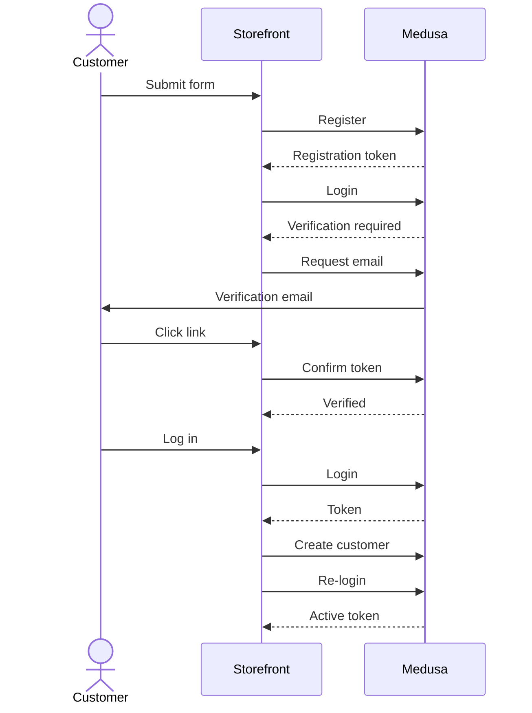

---
tags:
  - customer
  - storefront
  - auth
products:
  - customer
  - auth
---

import { CodeTabs, CodeTab, Prerequisites, Table } from "docs-ui"

export const metadata = {
  title: `Register Customer with Email Verification in Storefront`,
}

# {metadata.title}

In this guide, you'll learn how to implement a customer registration flow with email verification in your storefront.

<Note>

If you don't have email verification enabled in the Medusa application, follow the [Register Customer in Storefront](../register/page.mdx) guide instead.

</Note>

<Note>

This guide has been updated since Medusa [v2.16.0](https://github.com/medusajs/medusa/releases/tag/v2.16.0), which made changes to the overall verification flow.

</Note>

<Prerequisites
  items={[
    {
      text: "Medusa v2.16.0 or later",
      link: "!docs!/learn/update"
    },
    {
      text: "Email verification email sending implemented in the Medusa application",
      link: "/commerce-modules/auth/email-verification"
    }
  ]}
/>

## Register Customer with Verification Flow

By default, Medusa doesn't require email verification for customers. When [email verification is enabled](../../../commerce-modules/auth/email-verification/page.mdx#enable-email-verification), the registration flow is as follows:



1. Show the customer a form to enter their details.
2. Send a `POST` request to the `/auth/customer/emailpass/register` [Get Registration Token](!api!/store#auth_postactor_typeauth_provider_register) API route to obtain a registration JWT token.
3. Request returns a registration JWT token if the registration is successful.
4. Redirect customer to login.
5. Send a `POST` request to the `/auth/customer/emailpass` [Login Customer](!api!/store#auth_postactor_typeauth_provider) API route, passing the registration JWT token in the header.
6. Request returns an object indicating that verification is required.
7. Send a `POST` request to the `/auth/verification/request` [Request Verification Email](!api!/store#auth_postactor_typeauth_provider_verification_request) API route to send the verification email to the customer.
8. Customer receives the email and clicks the verification link, which is a page in the storefront.
9. The verification page sends a `POST` request to the `/auth/verification/confirm` [Confirm Verification](!api!/store#auth_postactor_typeauth_provider_verification_confirm) API route to verify the customer's email using the `token` query parameter in the URL.
10. Once the email is verified, the customer can log in.
11. During login, if the email is verified but the customer's account is not active, send a request to the [Register Customer API route](!api!/store#customers_postcustomers) passing the login JWT token in the header.
12. Login the customer again to obtain an active JWT token.

This guide will cover how to:

1. Create a registration page with email verification.
2. Handle the login flow for customers that need to verify their email.
3. Create a verification page that the customer receives in the email.

---

## Step 1: Create the Registration Page

The registration page implements steps one to four of the [email verification flow](#register-customer-with-verification-flow). The page shows a form to collect the customer's details, sends a request to the registration API route to obtain a registration token, then redirects the customer to the login page.

The following example shows the updated registration page:

<CodeTabs group="store-request">
  <CodeTab label="React" value="react">

export const registerHighlights = [
  ["24", "register", "Register the customer to obtain a registration token."],
  ["31", "if", "Surface unexpected errors. An existing-identity error is expected and handled below."],
  ["46", "localStorage.setItem", "Persist the first and last name to use after verification on the login page."],
  ["51", "", "Redirect the customer to the login page to continue the flow."],
]

  ```tsx highlights={registerHighlights} collapsibleLines="54-92" expandButtonLabel="Show form"
  "use client" // include with Next.js 13+

  import { useState } from "react"
  import { sdk } from "@/lib/sdk"
  import { FetchError } from "@medusajs/js-sdk"

  export default function Register() {
    const [loading, setLoading] = useState(false)
    const [firstName, setFirstName] = useState("")
    const [lastName, setLastName] = useState("")
    const [email, setEmail] = useState("")
    const [password, setPassword] = useState("")

    const handleRegistration = async (
      e: React.MouseEvent<HTMLButtonElement, MouseEvent>
    ) => {
      e.preventDefault()
      if (!firstName || !lastName || !email || !password) {
        return
      }
      setLoading(true)

      try {
        await sdk.auth.register("customer", "emailpass", {
          email,
          password,
        })
      } catch (error) {
        const fetchError = error as FetchError

        if (
          fetchError.statusText !== "Unauthorized" ||
          fetchError.message !== "Identity with email already exists"
        ) {
          setLoading(false)
          alert(`An error occurred while creating account: ${fetchError}`)
          return
        }
        // another identity (for example, admin user) exists
        // with the same email. The customer can still log in
        // to link a customer record.
      }

      // persist signup fields so the login page can use them
      // to create the customer after verification.
      localStorage.setItem(
        "pending_customer",
        JSON.stringify({ email, firstName, lastName })
      )
      setLoading(false)
      // TODO redirect to the login page
    }

    return (
      <form>
        <input 
          type="text" 
          name="first_name"
          value={firstName}
          placeholder="First Name"
          onChange={(e) => setFirstName(e.target.value)}
        />
        <input 
          type="text" 
          name="last_name"
          value={lastName}
          placeholder="Last Name"
          onChange={(e) => setLastName(e.target.value)}
        />
        <input 
          type="email" 
          name="email"
          value={email}
          placeholder="Email"
          onChange={(e) => setEmail(e.target.value)}
        />
        <input 
          type="password" 
          name="password"
          value={password}
          placeholder="Password"
          onChange={(e) => setPassword(e.target.value)}
        />
        <button
          disabled={loading}
          onClick={handleRegistration}
        >
          Register
        </button>
      </form>
    )
  }
  ```

  </CodeTab>
  <CodeTab label="JS SDK" value="js-sdk">

export const registerSdkHighlights = [
  ["6", "register", "Register the customer to obtain a registration token."],
  ["13", "if", "Surface unexpected errors. An existing-identity error is expected and handled below."],
  ["25", "localStorage.setItem", "Persist the first and last name to use after verification on the login page."],
  ["29", "", "Redirect the customer to the login page to continue the flow."],
]

  ```ts highlights={registerSdkHighlights}
  // other imports...
  import { FetchError } from "@medusajs/js-sdk"

  const handleRegistration = async () => {
    try {
      await sdk.auth.register("customer", "emailpass", {
        email,
        password,
      })
    } catch (error) {
      const fetchError = error as FetchError

      if (
        fetchError.statusText !== "Unauthorized" ||
        fetchError.message !== "Identity with email already exists"
      ) {
        alert(`An error occurred while creating account: ${fetchError}`)
        return
      }
      // another identity exists with the same email.
      // the customer can still log in to link a customer record.
    }

    // persist signup fields so the login page can use them.
    localStorage.setItem(
      "pending_customer",
      JSON.stringify({ email, firstName, lastName })
    )
    // redirect the customer to the login page.
  }
  ```

  </CodeTab>
</CodeTabs>

In the above example, you implement the registration flow as follows:

- Obtain a registration JWT token from the `/auth/customer/emailpass/register` API route using the `auth.register` method. The token isn't usable until the customer verifies their email, which the login page handles.
- Persist the customer's first and last name in `localStorage` so that the login page can use them to create the customer after verification.
- If an error is thrown:
  - If the error is an existing identity error, the customer can still continue to the login page to link a customer record. This is useful when another identity, such as an admin user, exists with the same email.
  - For other errors, show an alert and exit execution.
- After registering, redirect the customer to the login page to continue the registration flow.

The JS SDK automatically stores and re-uses the authentication headers or session in the `auth.register` and `auth.login` methods. So, if you're not using the JS SDK, make sure to pass the received authentication tokens as explained in the [API reference](!api!/store#1-bearer-authorization-with-jwt-tokens).

---

## Step 2: Create the Login Page

The login page implements steps five to twelve of the [email verification flow](#register-customer-with-verification-flow). When the customer logs in, if verification is required, request the verification email and prompt the customer to check their inbox.

After the customer verifies their email and logs in again, if the email is verified but the customer's account is not active, send a request to the [Register Customer API route](!api!/store#customers_postcustomers) passing the login JWT token in the header, then log in the customer again to obtain an active JWT token.

The following example shows the updated login page:

<CodeTabs group="store-request">
  <CodeTab label="React" value="react">

export const loginHighlights = [
  ["25", "login", "Send a request to obtain a JWT token."],
  ["34", "if", "Check whether the response indicates that verification is required."],
  ["37", "request", "Request the verification email to be sent to the customer."],
  ["42", "alert", "Show a `check your email` message to the customer."],
  ["54", "decodeToken", "Decode the token to check if the customer is activated."],
  ["56", "!payload?.actor_id", "Check whether customer is active."],
  ["59", "localStorage.getItem", "Retrieve the persisted first and last name."],
  ["62", "create", "Create the customer record using the registration token."],
  ["73", "login", "Re-login to mint a token with the populated `actor_id`."],
]

  ```tsx highlights={loginHighlights} collapsibleLines="87-105" expandButtonLabel="Show form"
  "use client" // include with Next.js 13+

  import { useState } from "react"
  import { sdk } from "@/lib/sdk"
  import { decodeToken } from "react-jwt"

  export default function Login() {
    const [loading, setLoading] = useState(false)
    const [email, setEmail] = useState("")
    const [password, setPassword] = useState("")

    const handleLogin = async (
      e: React.MouseEvent<HTMLButtonElement, MouseEvent>
    ) => {
      e.preventDefault()
      if (!email || !password) {
        return
      }

      setLoading(true)

      let result: string | { verification_required: boolean } | { location: string }

      try {
        result = await sdk.auth.login("customer", "emailpass", {
          email,
          password,
        })
      } catch (error) {
        alert(`An error occurred while logging in: ${error}`)
        return
      }

      if (typeof result === "object" && "verification_required" in result && result.verification_required) {
        // resend the verification email and route the customer back
        // to the pending-verification UI.
        await sdk.auth.verification.request({
          entity_id: email,
          entity_type: "email",
        })
        setLoading(false)
        alert(`We sent a verification link to ${email}. Check your inbox.`)
        return
      }

      if (typeof result !== "string") {
        alert(
          "Authentication requires more actions, which isn't supported by this flow."
        )
        return
      }

      let token = result
      const payload = decodeToken(token) as { actor_id?: string } | null

      if (!payload?.actor_id) {
        // link a customer to the auth identity using the registration token.
        const pending = JSON.parse(
          localStorage.getItem("pending_customer") || "{}"
        )

        await sdk.store.customer.create(
          {
            email,
            first_name: pending.firstName,
            last_name: pending.lastName,
          },
          {},
          { authorization: `Bearer ${token}` }
        )

        // re-login to mint a token with the populated actor_id.
        token = (await sdk.auth.login("customer", "emailpass", {
          email,
          password,
        })) as string

        localStorage.removeItem("pending_customer")
      }

      // all next requests are authenticated.
      const { customer } = await sdk.store.customer.retrieve()
      console.log(customer)
      setLoading(false)
    }

    return (
      <form>
        <input 
          type="email" 
          name="email"
          value={email}
          placeholder="Email"
          onChange={(e) => setEmail(e.target.value)}
        />
        <input 
          type="password" 
          name="password"
          value={password}
          placeholder="Password"
          onChange={(e) => setPassword(e.target.value)}
        />
        <button
          disabled={loading}
          onClick={handleLogin}
        >
          Login
        </button>
      </form>
    )
  }
  ```

  </CodeTab>
  <CodeTab label="JS SDK" value="js-sdk">

export const loginSdkHighlights = [
  ["7", "login", "Send a request to obtain a JWT token."],
  ["16", "if", "Check whether the response indicates that verification is required."],
  ["17", "request", "Request the verification email to be sent to the customer."],
  ["21", "alert", "Show a `check your email` message to the customer."],
  ["31", "decodeToken", "Decode the token to check if the customer is activated."],
  ["33", "!payload?.actor_id", "Check whether customer is active."],
  ["35", "localStorage.getItem", "Retrieve the persisted first and last name."],
  ["38", "create", "Create the customer record using the registration token."],
  ["48", "login", "Re-login to mint a token with the populated `actor_id`."],
]

  ```ts highlights={loginSdkHighlights}
  import { decodeToken } from "react-jwt"

  const handleLogin = async () => {
    let result: string | { verification_required: boolean } | { location: string }

    try {
      result = await sdk.auth.login("customer", "emailpass", {
        email,
        password,
      })
    } catch (error) {
      alert(`An error occurred while logging in: ${error}`)
      return
    }

    if (typeof result === "object" && "verification_required" in result && result.verification_required) {
      await sdk.auth.verification.request({
        entity_id: email,
        entity_type: "email",
      })
      alert(`We sent a verification link to ${email}. Check your inbox.`)
      return
    }

    if (typeof result !== "string") {
      alert("Authentication requires more actions, which isn't supported by this flow.")
      return
    }

    let token = result
    const payload = decodeToken(token) as { actor_id?: string } | null

    if (!payload?.actor_id) {
      const pending = JSON.parse(
        localStorage.getItem("pending_customer") || "{}"
      )

      await sdk.store.customer.create(
        {
          email,
          first_name: pending.firstName,
          last_name: pending.lastName,
        },
        {},
        { authorization: `Bearer ${token}` }
      )

      token = (await sdk.auth.login("customer", "emailpass", {
        email,
        password,
      })) as string

      localStorage.removeItem("pending_customer")
    }

    const { customer } = await sdk.store.customer.retrieve()
    console.log(customer)
  }
  ```

  </CodeTab>
</CodeTabs>

In the example above, you:

1. Create a `handleLogin` function that logs in a customer.
2. In the function, you log in the customer using the `sdk.auth.login` method.
    - If the response indicates that verification is required, resend the verification email and show a "check your email" message.
    - If an error occurs, show an alert and exit execution.
    - The method may return an object with a `location` property. This occurs when using third-party authentication providers. Learn more about implementing third-party authentication in the [Third-Party Login](../third-party-login/page.mdx) guide.
    - If the response is a token string, decode it to check if the `actor_id` is present.
      - If it's not present, it means that the customer record hasn't been created yet, so you create it using the registration token, then log in again to mint a token with the populated `actor_id`.
3. If no errors occur, all subsequent requests are now authenticated. As an example, you send a request to obtain the logged-in customer's details.

<Note title="Why re-login instead of `sdk.auth.refresh`?">

The post-register token's `actor_id` is empty, and `sdk.auth.refresh` can return another empty-`actor_id` token or fail. A fresh login after the customer is linked is guaranteed to produce a valid token.

</Note>

### Persisting Extra Signup Fields

Because customer creation is deferred to first login, any extra fields you collect at registration (`first_name`, `last_name`, `phone`, and so on) need to survive until then. You have two options:

- **Option A (simplest):** Only collect `email` and `password` at signup. Collect the rest on a "complete your profile" page after first login.
- **Option B:** Persist the extra fields temporarily and read them in the login flow before calling `customer.create`. The example in this guide uses Option B with `localStorage`, which works across tabs.

If you keep the extra fields in component state only, they are lost the moment the customer closes the tab to open their email. Persist to `localStorage` (or a similar storage) before showing the pending-verification UI.

### Handle Verification with Server Actions and Session Authentication

If you implement the login flow in a server action using session-based authentication, the session cookie set by the `/auth/session` API route isn't persisted between calls in the same server action. So, when the login response indicates that verification is required, you must pass the token returned in that response manually as a bearer token in the `Authorization` header when requesting the verification email.

For example, where `token` is the response of the `sdk.auth.login` method:

```ts
if (typeof token === "object" && token.verification_required) {
  // In a server action there's no cookie jar, so a
  // session cookie set by /auth/session wouldn't carry
  // over to the next request. Pass the actorless token
  // returned from login directly as a bearer token to
  // authenticate the verification request instead.
  await sdk.client.fetch("/auth/verification/request", {
    method: "POST",
    headers: {
      Authorization: `Bearer ${token.token}`,
    },
    body: {
      entity_id: email,
      entity_type: "email",
      code_provider: "token",
    },
  })

  return { verification_required: true }
}
```

This guide's examples are otherwise client-side and rely on `localStorage` and the JS SDK's automatic token storage. If your storefront uses session-based authentication (like the official Next.js starter), make sure the session cookie is persisted between requests. The bearer-token caveat above applies anywhere you request a verification email, including the resend flow that runs after an unverified login.

---

## Step 3: Create the Verify Account Page

Next, create a page in your storefront at the path that the verification link points to (for example, `/verify-account`). The page reads the `token` from the query string and sends it to the [Confirm Verification API route](!api!/store#auth_postactor_typeauth_provider_verification_confirm) to verify the customer's email.

For example, create the page at `src/app/verify-account/page.tsx` with the following content:

<CodeTabs group="store-request">
  <CodeTab label="React" value="react">

export const verifyHighlights = [
  ["8", "useSearchParams", "Read the token from the query string."],
  ["22", "confirm", "Verify the customer's email."],
]

```tsx highlights={verifyHighlights}
"use client"

import { useEffect, useState } from "react"
import { useSearchParams, useRouter } from "next/navigation"
import { sdk } from "@/lib/sdk"

export default function VerifyAccount() {
  const searchParams = useSearchParams()
  const router = useRouter()
  const token = searchParams.get("token")
  const [state, setState] = useState<"verifying" | "success" | "error">(
    "verifying"
  )

  useEffect(() => {
    if (!token) {
      setState("error")
      return
    }

    sdk.auth.verification
      .confirm({ code: token })
      .then(() => setState("success"))
      .catch(() => setState("error"))
  }, [token])

  if (state === "verifying") {
    return <div>Verifying your email...</div>
  }

  if (state === "success") {
    return (
      <div>
        <p>Your email is verified. You can now log in.</p>
        <button onClick={() => router.push("/login")}>Go to login</button>
      </div>
    )
  }

  return (
    <div>
      <p>
        The verification link is invalid or has expired. Log in
        again to receive a new verification email.
      </p>
      <button onClick={() => router.push("/login")}>Go to login</button>
    </div>
  )
}
```

  </CodeTab>
  <CodeTab label="JS SDK" value="js-sdk">

export const verifySdkHighlights = [
  ["3", "URLSearchParams", "Read the token from the query string."],
  ["13", "confirm", "Verify the customer's email."],
]

```ts highlights={verifySdkHighlights}
import { sdk } from "@/lib/sdk"

const searchParams = new URLSearchParams(window.location.search)
const token = searchParams.get("token")

const handleVerification = async () => {
  if (!token) {
    alert("Invalid verification link.")
    return
  }

  try {
    await sdk.auth.verification.confirm({ code: token })
    alert("Email verified. You can now log in.")
  } catch (error) {
    alert(
      "The link is invalid or has expired. Log in again to get a new email."
    )
  }
}
```

  </CodeTab>
</CodeTabs>

You add handling for three states in the verification page:

- `verifying`: The page is verifying the token by sending a request to the Medusa application.
- `success`: The token is verified. The customer can now log in.
- `error`: The token is invalid or expired. The customer is directed back to the login page to receive a new verification email.

When the page loads, the `useEffect` hook reads the `token` from the query string and sends it to the `sdk.auth.verification.confirm` method. If the request succeeds, the state is set to `success`. Otherwise, it's set to `error`.
