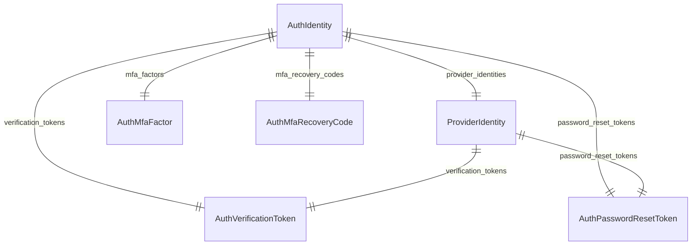

import { TypeList } from "docs-ui"

# Auth Module Data Models Reference

This documentation provides a reference to the data models in the Auth Module

## Relations Overview

## Data Models

- [AuthIdentity](../../auth_models/variables/auth_models.AuthIdentity/page.mdx)
- [AuthMfaFactor](../../auth_models/variables/auth_models.AuthMfaFactor/page.mdx)
- [AuthMfaRecoveryCode](../../auth_models/variables/auth_models.AuthMfaRecoveryCode/page.mdx)
- [AuthPasswordResetToken](../../auth_models/variables/auth_models.AuthPasswordResetToken/page.mdx)
- [AuthVerificationToken](../../auth_models/variables/auth_models.AuthVerificationToken/page.mdx)
- [ProviderIdentity](../../auth_models/variables/auth_models.ProviderIdentity/page.mdx)
